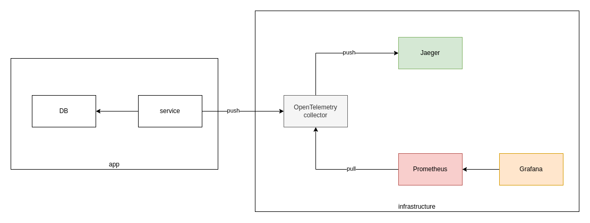
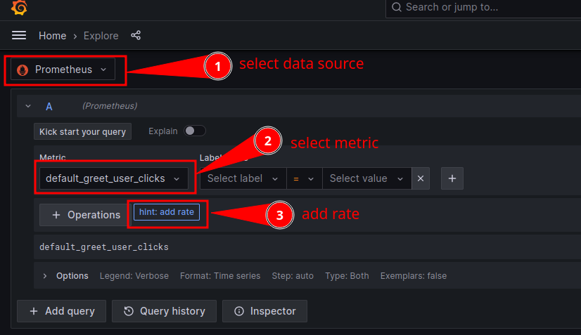

# opentelemetry metrics example

## Architecture



## Getting started

- Bootstrap underlying infrastructure:
  ```
  docker compose -f docker-compose.infra.yaml up
  ```

- Run the app
  ```
  npm install
  npm run watch
  ```

- Make some requests:
  - `http://localhost:3333`
  - `http://localhost:3333/user/someuser`

- Check your metrics in Prometheus: `http://localhost:9090`

- Visualize the data in Grafana: `http://localhost:3000`
  - Default user:password is `admin:admin`
  - Make sure prometheus is added as the default data source in `http://localhost:3000/connections/datasources` 
  - Explore the metrics: `http://localhost:3000/explore`

    

# Additional links

- https://opentelemetry.io/docs/instrumentation/js/
- https://opentelemetry.io/docs/specs/otel/metrics/
- https://github.com/open-telemetry/opentelemetry-js/blob/main/doc/metrics.md
- https://github.com/open-telemetry/opentelemetry-js-contrib/tree/main/examples
